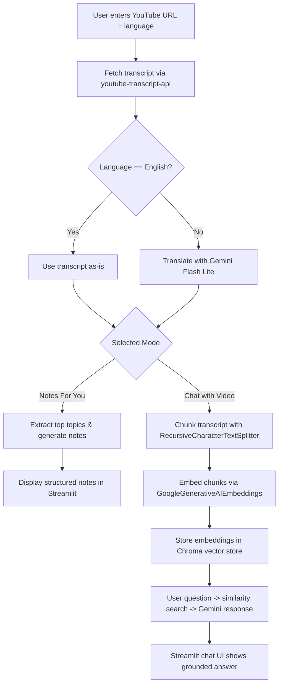

# YouTube Study Bud

A Streamlit-powered RAG assistant that turns any YouTube video into structured study material. Paste a video link, optionally translate the transcript, generate concise notes, or spin up a chat interface backed by vector search over the transcript.

## Features
- **Transcript ingestion** – Retrieves captions in the language you specify via `youtube-transcript-api`.
- **Optional translation** – Pipes non-English transcripts through Gemini Flash Lite for accurate English output.
- **Notes & topics** – Generates bullet-point notes and the top five topics with prompt-engineered Gemini calls.
- **Chat with video** – Splits the transcript into overlapping chunks, embeds them with `GoogleGenerativeAIEmbeddings`, stores them in Chroma, and answers questions with a LangChain RAG chain.

## Architecture
- `app.py` hosts the Streamlit UI (sidebar inputs, processing flow, and chat session state).
- `Supporting_functions.py` centralizes transcript handling, Gemini prompt chains, text chunking, embedding, vector-store creation, and the RAG answer function.
- LangChain handles prompt templating, text splitting, embeddings, and vector search orchestration.
- Chroma runs in-memory for fast similarity lookups during chat sessions.

## Flowchart


## Getting Started
1. **Install Python** – Use Python 3.10+ (project developed against 3.11).
2. **Create a virtual environment**
   ```bash
   python -m venv .venv
   source .venv/bin/activate  # Windows: .venv\\Scripts\\activate
   ```
3. **Install dependencies**
   ```bash
   pip install -r requirements.txt
   ```
4. **Configure environment variables** – Create a `.env` file that contains
   ```bash
   GOOGLE_API_KEY=your_gemini_api_key
   ```
   The key must have access to Gemini Flash Lite for chat and `models/embedding-001` for embeddings.
5. **Run the app**
   ```bash
   streamlit run app.py
   ```

## Usage Workflow
1. Open the sidebar and paste a YouTube URL plus the transcript language code (e.g., `en`, `hi`, `es`).
2. Choose one of the modes:
   - **Notes For You** – Generates key topics and structured notes directly from the transcript.
   - **Chat with Video** – Builds the vector store, then exposes a chat box where every turn performs similarity search followed by a grounded Gemini response.
3. Click **"✨ Start Processing"** and watch the progress spinners for transcript fetch, translation (if needed), chunking, and note/chat preparation.
4. In chat mode, ask follow-up questions; the full conversation history is preserved via `st.session_state`.

## Troubleshooting
- **GoogleGenerativeAIError 429 (quota exceeded)** – Gemini embeddings require paid quota. Enable billing on the Google Cloud project tied to `GOOGLE_API_KEY` or switch your code to a local embedding model (e.g., `SentenceTransformerEmbeddings`) before creating the vector store.
- **Missing API key** – `_get_api_key()` raises an error if `GOOGLE_API_KEY` is absent. Ensure the `.env` file is loaded or export the variable in your shell before starting Streamlit.
- **Transcript not found** – The YouTube transcript API only works on videos with captions enabled. Verify the video supports the requested language.

## Project Structure
```
.
├── app.py                  # Streamlit UI and main workflow
├── Supporting_functions.py # Transcript, Gemini, embedding, and RAG helpers
├── requirements.txt        # Python dependencies
└── README.md               # Project documentation
```

## Next Steps
- Add a local embedding fallback to keep chat working without Gemini embedding quota.
- Persist the Chroma database on disk if you want cross-session reuse.
- Extend the UI with audio summaries (e.g., via `gtts`) or downloadable note files.

